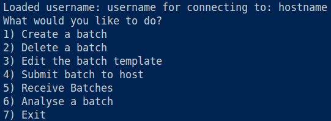

= BSS-Batch-Manager
This repository is designed to manage batches for https://github.com/MarshTheBacca/Bond-Switch-Simulator.git[Bond Switch Simulator]

== Setup

The project has been setup using https://docs.astral.sh/uv/[uv]

You can also define the following config options in link:config.csv[config.csv]

* _username_ - The username used to SSH into the host when submitting batches (defaults to your current system username)
* _hostname_ - The server address the program submits batches to __(required)__

__You must have an SSH key__ for the host added to your SSH agent

__You must also be able to access the host__ either via local network or via a VPN

[source, bash]
----
git clone git@github.com:MarshTheBacca/BSS-Batch-Manager.git --recurse-submodules
uv run main.py
----

== Interface

The program uses an integer-based menu system. Your inital options are:

=== Create a batch

You will be prompted to choose the following:

* A starter network from link:networks[networks]
* A https://github.com/lammps/lammps[LAMMPS] potential file from link:potentials[potentials]
* Variables of the Bond Switch Simulator parameters to vary (maximum of 9)

After choosing your variables, for each one, you will be prompted to choose a method of variation, which changes depending on the variable

Variables that are not chosen will remain as defined in the link:common_files/bss_parameters.txt[batch template] for all jobs in the batch

The batch will be saved as a zip file in link:batches[batches]

=== Delete a batch

The program will scan all batches in the link:batches[batches] directory and prompt the user to delete one

=== Edit the batch template

The program will prompt the user to choose a variable to edit in the link:common_files/bss_parameters.txt[batch template] and give a new value until they exit

=== Submit batch to host
The program will prompt the user to choose a batch to submit, while also displaying information such as the number of jobs and date submitted (sorted by latest submission first)

Upon confirmation of submission, a daemon process is initiated which does the following:

* Checks to see if you have the relevent files in your home directory on the host, if not, copies over link:common_files/BSS-Batch-Manager-Remote[your local copy]
* Sends over the batch zip and executes the link:common_files/BSS-Batch-Manager-Remote/remote_management/batch_submission_script.py[remote python script] on the host
* Executes link:common_files/BSS-Batch-Manager-Remote/remote_management/check_file_exists.sh[check_file_exists.sh] on the host every 5 seconds until the output batch zip has been detected
* Copies over the batch output zip, deletes it on the host and unzips it into link:output_files[output_files]

The log of this script is placed in /utils/batch_submit.log

The remote python script does the following:

* Unzips the batch
* Copies in all relevant files in the correct directories, ie, the initial network, potential files and bss_parameters.txt
* Creates a unique job script for each job
* Submits each job script using qsub (with a maximum of __200__ jobs allowed in parallel)
* Creates a batch output zip, including the necessary output files and logs (not the lammps.log or executable files for storage reasons)
* Deletes all other batch files

__PLEASE NOTE__ that if for whatever reason the batch output zip is not created or otherwise not detectable, the daemon process will continue to check for the next __5 months__. Should you wish to terminate the daemon process, use `ps -ef | grep batch_submit.py` and note the process ID (1st 5 digit number on line on Linux systems). Then use `kill [process ID]`. You could also shutdown your computer.

== Troubleshooting
Make sure you've configued your _username_ and _hostname_ in link:config.csv[config.csv] correctly

Make sure you have an SSH key for the host and you can access it (test with commands like `ping [hostname]`)

If you're successfully transferring over batches, but they aren't executing properly, you may need to do the following:

* Re-compile the link:common_files/BSS-Batch-Manager/bond_switch_simulator.exe[executable] on your host
* Replace your existing local copy
* Delete the BSS-Batch-Manager folder in your host's home directory
* Re-run the program.

